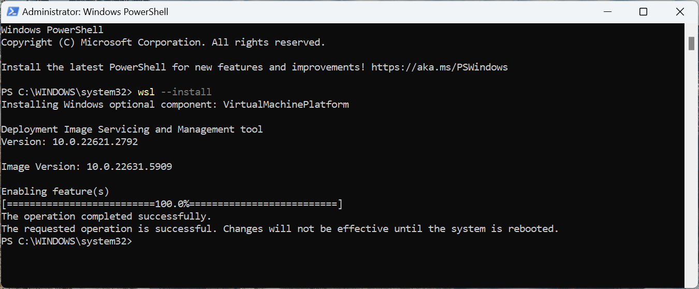
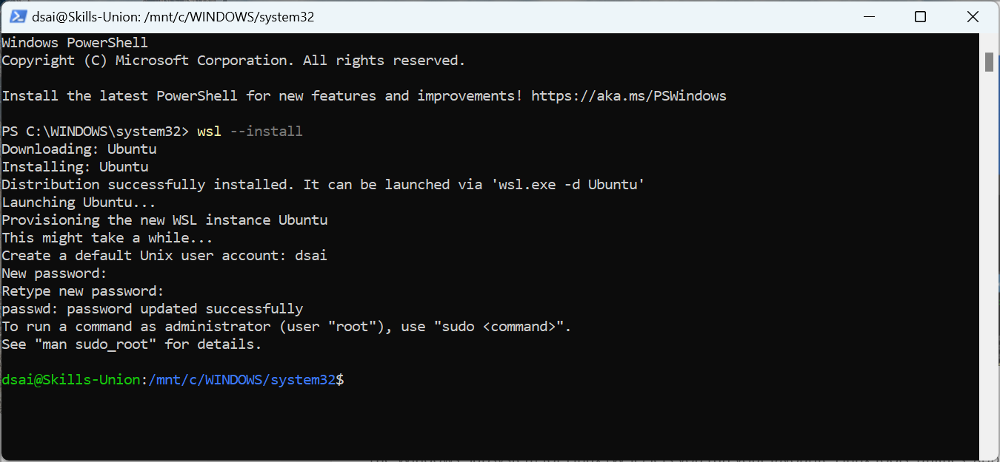
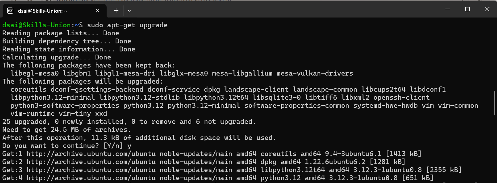
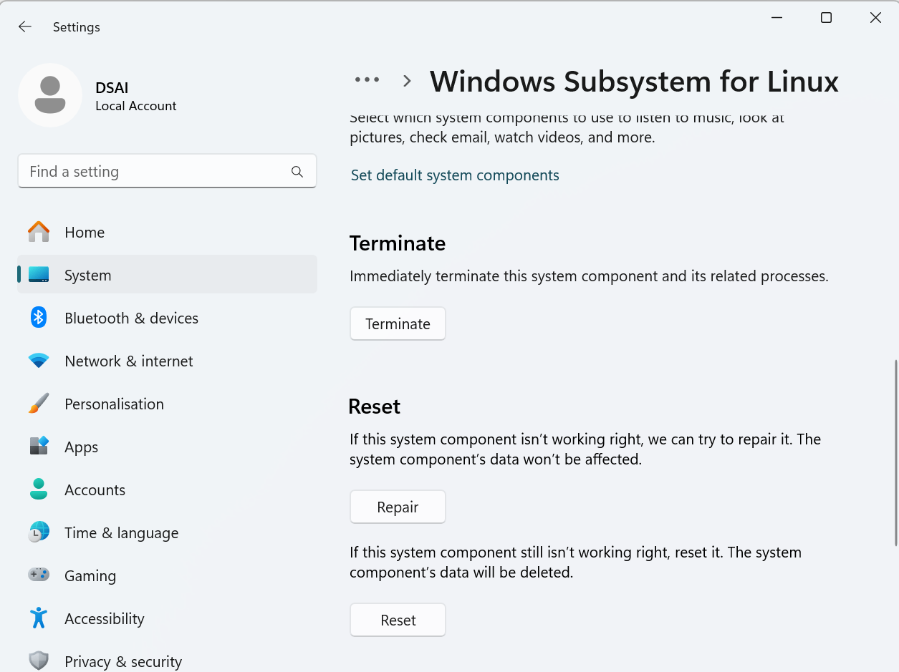
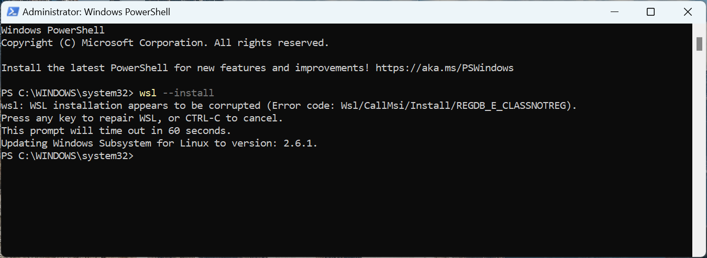

# Install WSL for Windows user

There are 2 processes in installing WSL. Both processes use the same command.
- First process is to install the system component mainly `Virtual Machine Platform`. You need to reboot the PC after installation of the system component.
- The second process is to install the Linux operating system. We will be using the default `Ubuntu`


## Install WSL System Component
We need to run the following command from **Windows Powershell as administrator**. 

```bash
wsl --install
```

The resulting screen, should be similar to below:


> **Please note that the screen may varies according to different version of Windows. For Window 10 users, you may see 2 components installed instead of 1.**

After installation, we need to **reboot the PC**.

You can check the component installed using `Turn Windows Features on or off` app. You can find the app by searching `features` from the search bar.

The component is checked


Note:
> **For newer PC, we will be using WSL2 which only need one system component `Virtual Machine Platform`.**
>**For Windows 10 user, we might need additional system component `Windows Subsystem for Linux`. Therefor you may see 2 component checked.** 


## Install Linux:Ubuntu
After the PC is rebooted, launch **Windows Powershell as administrator**. 

```bash
wsl --install
```

You should have similar setup screen as shown below:


> **Note: You will be asked to setup your Linux account with a username and password. If you have successfully setup the Linux account and password, then the installation is considered as successful.**

### Video Run-Through
- [Install WSL Component v1](https://drive.google.com/file/d/1J_F6NsP9RS_R-arm46_9XraIiaaLbDx1/view?usp=drive_link)
- [Install WSL Component v2](https://drive.google.com/file/d/1Z49xLTORh452UYYe5AGz9L-cERlkvrq1/view?usp=drive_link)
- [Install Ubuntu in WSL v1](https://drive.google.com/file/d/1x5g8fqUdOpkkiCVQjFIsOwwZ0dtG-ceL/view?usp=drive_link)
- [Install Ubuntu in WSL v2](https://drive.google.com/file/d/1tdDbw8Xo8kna9RiiWpll5NX2k6d0q0hQ/view?usp=drive_link)

## Update Ubuntu

We also use the following command to update Linux system:
```bash
sudo apt-get update
sudo apt-get upgrade
```
The first command is to get the update information from Ubuntu. See the quote from Google:

> The `sudo apt-get update` command, run in a Linux terminal, refreshes your system's local package index by downloading the latest package information from software repositories. This allows your system to recognize new versions of software or new packages that have been added to the repositories, but it does not actually install or upgrade any software;

Use the following command to get the latest package information:
```bash
sudo apt-get update
```

Sample update screen:


To run the actual update, use the following command

```bash
sudo apt-get upgrade
```

It should be something similar below:


### Video Run-Through
- [Updating Ubuntu System v1](https://drive.google.com/file/d/1VJiFZswo05D43ikysVMJGR5OK24Jzt1L/view?usp=drive_link)
- [Updating Ubuntu System v2](https://drive.google.com/file/d/1qdGGGXz0OlPROR4r0Lnnn5OrGoiwp1nL/view?usp=drive_link)

## Troubleshoot WSL 

- If there is problem with WSL component installation, you can checked and uncheck the component `Virtual Machine Platform`. 


- For older system, you may need to check and uncheck 2 components: `Virtual Machine Platform` and `Windows Subsystem for Linux`.


- Alternatively, we can also user system component repair by going to `Settings` -> `Apps` -> `Installed Apps`, scroll down to related settings and select  `System Components`. Next, look for `Windows Subsystem for Linux` and click `Advanced options`. You can choose to `repair` or `reset` WSL.



- Sometimes, the system will prompt for auto-repair during installation as shown below:



### Video Run-Through
- [Troubleshooting WSL v1](https://drive.google.com/file/d/1b0mni46BqZm-_LJ7OBB9pB0pgPcV9ElN/view?usp=drive_link)
- [Troubleshooting WSL v2](https://drive.google.com/file/d/1TtA_LWObjLV63qWKY86qSlfs-KfVgSZZ/view?usp=drive_link)


